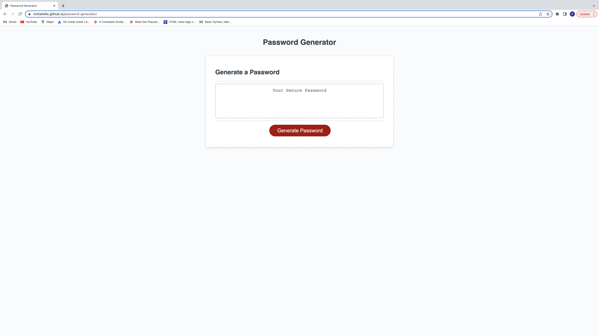

# password-generator

Password generator website.

## Description

When the user clicks the Generate Password button, they will be prompted with questions that will set requiremnets for the password.

The user will answer the prompts accordingly. If the user inputs a value that is not accpeted, they will be asked the prompt again. 

Once all prompts are answered correctly, a password will generate the text area that meets the users selected requirements.

If the user so chooses to generate another password, they can click the Generate Password button again to reset and generate a new password.

## Screenshot

## Links 

GitHub 

https://github.com/richielollis/password-generator

Deployed Website 

https://richielollis.github.io/password-generator/
